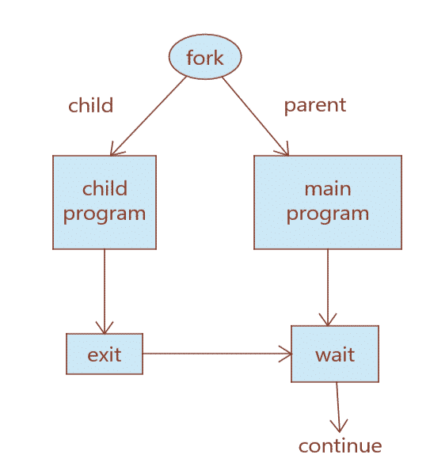
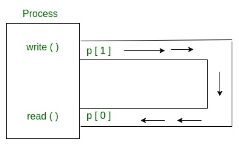
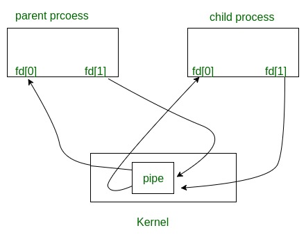

## Let's take a quick look at the shell overview

A shell is a command-line interpreter that acts bridge between the user and operating system. When you press Enter after typing a command, the terminal sends it to the shell for processing.

## Approach to create a basic shell

### Receive input from user

- First of all, we need to receive input through the command line

### Parsing input

- Split the input into tokens, such as `ls -a` to `["ls", "-a"]`
- If we detect a pipe command "|"
  - Split it into 2 command that is left and right command

### Executing Command

- We use the `fork()` concept to create child process
- The parent process waits for the child process until finish

#### What is `fork()` ?

- `fork()` creates a new process from the parent process, that it call child process
- The child process use same pc(program counter) and same CPU register and same file which use in parent process
- After that `fork()`, both processes continue execution from the point where fork() returns.



#### If we found a pipe command, we use a different ways from the one above

- Pipe is a communicate between two process
- We going to use `pipe` combine with `fork()`



- p[0]: for using read end
- p[1]: for using write end

### How to combine fork and pipe

**Inside the Parent Process**

- First, we close the reading end of the first pipe, p[0]
- Then, we write data to the writing end of the first pipe, p[1]
- The parent process waits for the child process to finish

**Inside the Child Process**

- The child closes the writing end of the first pipe, p[1]
- It reads the data from the reading end, p[0]
- Finally, the child process exits



## How to run this project

Clone this repository

```
git clone https://github.com/zersix225/sersiz-shell.git
```

Run Command

`make` & `./main`
